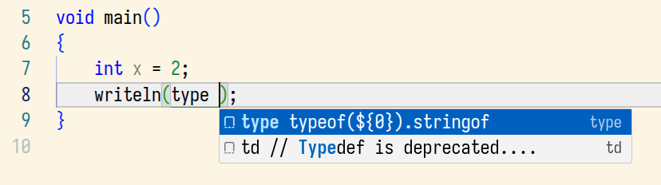
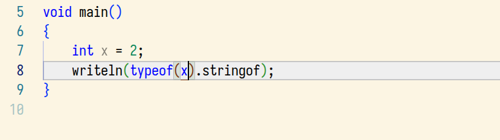

# Convert snipMate to VS Code

Convert snippets using snipMate format to VS Code's JSON format.

## Problem

I use VS Code a lot and snippets are very useful. However, writing
snippets (especially multi-line, longer) snippets in VS Code's JSON
format is a PITA. I found an [online generator](https://snippet-generator.app/?description=&tabtrigger=&snippet=&mode=vscode), but still. Just look at this:

```json
    "input()": {
        "prefix": "input() import std.string; // rea...",
        "body": [
            "import std.string; // readln(), chomp()",
            "",
            "string input(const string msg = \"\")",
            "{",
            "    write(msg);",
            "    // chomp() removes the trailing newline",
            "    return readln().chomp();",
            "}"
        ],
        "description": "import std.string; // readln(), chomp()"
    },
```

What if I want to modify the body? There must be a better way!

## Solution

I also use Neovim, and I found a [snippet plugin](https://github.com/L3MON4D3/LuaSnip)
that supports a snippet format (called snipMate) that is MUCH simpler. Let's
see the previous snippet in this format:

```
snippet input()
	import std.string; // readln(), chomp()

	string input(const string msg = "")
	{
		write(msg);
		// chomp() removes the trailing newline
		return readln().chomp();
	}
```

That's all. After the keyword `snippet`, provide a trigger
string (here: `input()`), and then provide the body as a plain
text. The lines must be indented by a TAB (like in a Makefile),
but that's all.

## The converter

Since I use both Neovim and VS Code, I only want to update just
one snippet file per language. And it should be the simpler one,
the snipMate format. But how to use the same snippets in VS Code too?
I wrote a converter for that. Its usage is very simple:

```shell
$ python3 convert_snippet_to_vscode.py d.snippets
{
    "pimp": {
        "prefix": "pimp public import",
        "body": [
            "public import"
        ],
        "description": "public import"
    },
...
```

I suggest using a shell script that redirects the output and
overwrites (updates) the VS Code snippet file. You can find
such a shell script in this repo.

Under Linux, the snippet files are here: `~/.config/Code/User/snippets`

## Workflow

* edit your `.snippets` file
* run the converter using a shell script
* use the snippet in VS Code

VS Code notices if a snippet file is changed and reloads it
automatically. You don't need to restart VS Code every time
when the snippets change.

## Tip

After the trigger word, I also add the beginning of the snippet.
In VS Code, this extra text is also displayed in the pop-up, making
it easier to select the snippet you need. This description is added
after the trigger string and is separated by a space. Thus, if you
know the trigger text, you can type it and add a space. This way
exactly your snippet will be found by VS Code.

Example: in `d.snippets`, I have a snippet called `type`. When I
write in just `type`, VS Code will bring up a lot of things
related to types. However, if I write `type ` (notice the space),
then it'll bring up my snippet at the first place.

## Screenshots

Start typing the trigger string. Press TAB to accept and activate the snippet.




Modify / customize the inserted text. Done.


